# Work Management Skill Suite: Full Lifecycle Integration

## Overview

The PAX work management skill suite now provides complete support for the full work-management process, from item creation through final PR acceptance and cleanup. This document describes how skills compose into a seamless workflow with clear transitions and feedback loops.

## Skill Architecture

### Atomic Skills (No Composition)

These skills manage specific responsibilities and don't depend on other skills:

- **[[create-work-item/SKILL]]**: Create new backlog items with standardized structure
- **[[update-work-item/SKILL]]**: Track progress on items during implementation
- **[[finalize-work-item/SKILL]]**: Archive completed items
- **[[feature-branch-management/SKILL]]**: Git operations (create, sync, cleanup branches)
- **[[copilot-pull-request/SKILL]] + [[gh-pr-review/SKILL]]**: Backend implementations for PR operations

### Facade/Unified Interface

- **[[pull-request-tool/SKILL]]**: Single interface for PR operations, auto-detects backend
- **[[PR_MANAGEMENT_INTERFACE]]**: Shared specification for all PR tools

### Workflow Skills (Compose Other Skills)

- **[[create-pr/SKILL]]**: Composes [[pull-request-tool/SKILL]] to create PRs from feature branches
- **[[handle-pr-feedback/SKILL]]**: Composes [[pull-request-tool/SKILL]], [[resolve-pr-comments/SKILL]], [[update-work-item/SKILL]]
- **[[resolve-pr-comments/SKILL]]**: Composes [[pull-request-tool/SKILL]], execution modes
- **[[merge-pr/SKILL]]**: Composes [[pull-request-tool/SKILL]], [[feature-branch-management/SKILL]]

### Orchestration Skills (Highest Level)

- **[[process-pr/SKILL]]**: End-to-end PR workflow (composes [[resolve-pr-comments/SKILL]], [[merge-pr/SKILL]], other skills)

### Skill Composition Visualization


## Full Lifecycle Workflow

### Complete Lifecycle Overview


### Phase 1: Item Creation

**User Action**: Request new work (feature, spike, task, bug fix)

```ascii-tree
create-work-item
├─ Input: Title, description, acceptance criteria, estimate
├─ Output: Work item file in /backlog/ with ID and status: not_started
└─ Next: update-work-item (to move to in_progress)
```

**Skills Involved**: [[create-work-item/SKILL]]

---

### Phase 2: Initialize Implementation

**User Action**: Start work on item

**Workflow**:

```ascii-tree
update-work-item (status: not_started → in_progress)
│
├─ Automatically invokes: feature-branch-management create feature/<id>-<slug>
│  ├─ Creates local feature branch
│  ├─ Checks out branch
│  └─ Records feature_branch in work item
│
├─ Updates work item:
│  └─ status: in_progress
│  └─ actual_hours: null (starts tracking)
│  └─ notes: Initial work plan
│
└─ Next: Developer implements on feature branch
```

**Skills Involved**:

- [[update-work-item/SKILL]] (orchestrator)
- [[feature-branch-management/SKILL]] (automatic branch creation)

**Output**: Work item in `in_progress`, feature branch created and checked out

---

### Phase 3: Implementation & Progress Tracking

**User Action**: Develop code, commit changes, track hours

**Developer Workflow** (outside skill system):

```ascii-tree
On feature branch:
├─ Edit code
├─ Commit changes (git commit)
├─ Push to remote (git push)
└─ Repeat until implementation complete
```

**Periodic Skill Invocations** (via update-work-item):

```ascii-tree
update-work-item record-progress
├─ Update actual_hours
├─ Add related_commit references
├─ Update notes with progress/blockers
└─ Keep status: in_progress
```

**Skills Involved**:

- [[update-work-item/SKILL]] (progress tracking)

**Output**: Work item tracks effort and implementation commits

---

### Phase 4: Readiness for Review

**User Action**: Implementation complete, ready for code review

**Workflow**:

```ascii-tree
update-work-item (status: in_progress → testing)
│
├─ Automatically invokes: feature-branch-management sync
│  ├─ Fetches latest main
│  ├─ Rebases feature branch on main
│  ├─ Resolves any conflicts
│  └─ Ensures clean commit history
│
├─ Automatically invokes: create-pr
│  ├─ Generates PR title from work item
│  ├─ Generates PR description from notes + commits
│  ├─ Creates PR on GitHub
│  └─ Records pr_number and pr_url in work item
│
├─ Updates work item:
│  ├─ status: testing
│  ├─ actual_hours: <finalized estimate>
│  ├─ pr_number: <auto-populated>
│  ├─ pr_url: <auto-populated>
│  └─ notes: "PR submitted for review"
│
└─ Next: Code review phase
```

**Skills Involved**:

- [[update-work-item/SKILL]] (orchestrator)
- [[feature-branch-management/SKILL]] (automatic branch sync)
- [[create-pr/SKILL]] (automatic PR creation)
- [[pull-request-tool/SKILL]] (via create-pr)

**Output**: PR created, work item in `testing`, branch synced and pushed

---

### Phase 5A: Review with Minor Feedback

**Scenario**: Reviewer provides minor comments (typos, clarifications)

**Workflow**:

```ascii-tree
handle-pr-feedback (interaction: yolo or collaborative)
│
├─ Fetch PR details and comments
├─ Classify comments by severity
├─ For trivial/minor comments:
│  └─ Automatically invoke: resolve-pr-comments
│     ├─ Fix typos, docs, tests
│     ├─ Commit changes
│     ├─ Push to feature branch
│     └─ Mark threads resolved
├─ Update work item (status stays: testing)
└─ Next: Re-review phase
```

**Skills Involved**:

- [[handle-pr-feedback/SKILL]] (triage and orchestration)
- [[resolve-pr-comments/SKILL]] (auto-fix minor issues)
- [[pull-request-tool/SKILL]] (comment operations)

**Output**: Comments addressed, PR updated, work item still in `testing`

---

### Phase 5B: Review with Major Feedback

**Scenario**: Reviewer requests significant changes or identifies design flaw

**Workflow**:

```ascii-tree
handle-pr-feedback (interaction: yolo or collaborative)
│
├─ Fetch PR details and comments
├─ Classify comments by severity
├─ Detect major/blocker feedback
├─ Decision: Significant rework needed
│
├─ Automatically invoke: update-work-item (reverse transition)
│  ├─ status: testing → in_progress
│  └─ notes: "PR feedback: [Issue]. Reverting to in_progress for rework."
│
├─ Automatically invoke: feature-branch-management sync (optional)
│  └─ Ensure branch up-to-date with main
│
└─ Next: Developer reworks implementation
```

**Skills Involved**:

- [[handle-pr-feedback/SKILL]] (feedback triage and decision)
- [[update-work-item/SKILL]] (status reversion)
- [[pull-request-tool/SKILL]] (comment operations)
- [[feature-branch-management/SKILL]] (optional sync)

**Output**: Work item reverted to `in_progress`, developer notified, feedback documented

---

### Phase 5C: Handling PR Throughout Review

**Scenario**: Multiple rounds of review/feedback

**Workflow** (Repeats UNTIL approved):

```pseudocode
Loop:
  handle-pr-feedback → address comments → update-work-item

Until: All comments addressed + Reviewer approves
```

**Skills Involved**:

- [[handle-pr-feedback/SKILL]] (feedback loop coordinator)
- [[resolve-pr-comments/SKILL]] (address specific comments)
- [[update-work-item/SKILL]] (status transitions as needed)

---

### Phase 6: Merge Ready

**Condition**: All reviews approved, CI passing, no blockers

**Workflow**:

```ascii-tree
merge-pr (or process-pr which includes merge-pr)
│
├─ Phase 1: Pre-Merge Verification
│  ├─ Fetch PR details
│  ├─ Verify approvals (required count met)
│  ├─ Check mergeable state (no conflicts)
│  └─ Verify all status checks pass
│
├─ Phase 2: Merge Decision
│  ├─ Determine readiness
│  └─ Select merge method (merge/squash/rebase)
│
├─ Phase 3: Execution
│  ├─ Execute merge to main
│  └─ Automatically invoke: feature-branch-management cleanup
│     ├─ Delete local branch
│     ├─ Delete remote branch
│     └─ Prune tracking references
│
├─ Phase 4: Finalization
│  ├─ Verify merge succeeded
│  └─ Report results
│
└─ Next: Finalization phase
```

**Skills Involved**:

- [[merge-pr/SKILL]] (orchestration)
- [[pull-request-tool/SKILL]] (operations)
- [[feature-branch-management/SKILL]] (cleanup)

**Output**: PR merged, branch deleted, merge confirmed

---

### Phase 7: Finalization & Archival

**User Action**: Archive completed work item

**Workflow**:

```ascii-tree
finalize-work-item
│
├─ Verify Completion
│  └─ All acceptance criteria met ✓
│
├─ Record Final Metrics
│  ├─ actual_hours: <final tally>
│  ├─ completed_date: 2026-02-15
│  ├─ test_results: <CI results URL>
│  └─ state_reason: success
│
├─ Automatic cleanup (if not already done)
│  └─ Invoke: feature-branch-management cleanup
│     └─ Ensure branch is gone locally and remotely
│
├─ Archive file
│  ├─ Move: /backlog/60_*.md → /backlog/archive/60_*.md
│  └─ Update index (if applicable)
│
└─ Complete: Work item archived, lifecycle finished
```

**Skills Involved**:

- [[finalize-work-item/SKILL]] (orchestration)
- [[feature-branch-management/SKILL]] (cleanup if needed)

**Output**: Work item archived, metrics recorded, branch cleaned

---

## Multi-Skill Orchestration

### Interaction Modes (Orthogonal to All Workflows)

Every workflow skill supports two interaction modes:

- **YOLO** (Autonomous): Execute automatically, minimal user interaction
- **Collaborative** (Interactive): Ask for confirmation, allow customization

Users can specify per workflow:

```bash
update-work-item id=60 interaction=yolo  # Auto-create branch
handle-pr-feedback pr_number=247 interaction=collaborative  # Ask before reverting
merge-pr pr_number=247 interaction=yolo  # Auto-merge if ready
```

### Execution Models (Orthogonal to Workflows)

Some workflows support parallel vs sequential execution:

- **Sequential** (default): One step at a time, respects dependencies
- **Parallel**: Independent operations run concurrently

Example:

```bash
resolve-pr-comments pr_number=247 execution-mode=parallel
# Multiple unrelated comments addressed in parallel
```

### Auto-Invocation Trigger Points

The architecture includes 5 critical trigger points where status changes or feedback detection automatically invoke downstream skills:

```mermaid
graph LR
    T1["TRIGGER 1<br/>not_started → in_progress"] -->|"update-work-item"| B1["feature-branch-management<br/>create"]
    B1 -->|"Result"| R1["✓ Feature branch<br/>created & checked out"]
    
    T2["TRIGGER 2<br/>in_progress → testing"] -->|"update-work-item"| B2["feature-branch-management<br/>sync"]
    T2 -->|"update-work-item"| C1["create-pr"]
    B2 -->|"Result"| R2["✓ Branch rebased<br/>on origin/main"]
    C1 -->|"Result"| R2C["✓ PR created<br/>Auto-populated"]
    
    T3["TRIGGER 3<br/>Major feedback<br/>detected"] -->|"handle-pr-feedback"| U1["update-work-item<br/>testing → in_progress"]
    U1 -->|"Result"| R3["✓ Work item<br/>reverted"]
    
    T4["TRIGGER 4<br/>Merge<br/>successful"] -->|"merge-pr"| C2["feature-branch-management<br/>cleanup"]
    C2 -->|"Result"| R4["✓ Local & remote<br/>branches deleted"]
    
    T5["TRIGGER 5<br/>Finalization"] -->|"finalize-work-item"| C3["feature-branch-management<br/>cleanup if needed"]
    C3 -->|"Result"| R5["✓ Final cleanup<br/>complete"]
    
    style T1 fill:#4caf50,color:#fff
    style T2 fill:#4caf50,color:#fff
    style T3 fill:#f44336,color:#fff
    style T4 fill:#4caf50,color:#fff
    style T5 fill:#4caf50,color:#fff
    style R1 fill:#c8e6c9
    style R2 fill:#c8e6c9
    style R2C fill:#c8e6c9
    style R3 fill:#ffccbc
    style R4 fill:#c8e6c9
    style R5 fill:#c8e6c9
```



## Feedback Loops

### Feedback Loop 1: Comment Addressing

```mermaid
graph TD
    A["PR Submitted"] -->|"Waiting for Review"| B["👁️ Reviewer Comments"]
    
    B -->|"handle-pr-feedback<br/>Fetch & Classify"| C{"Classify<br/>Feedback<br/>Severity"}
    
    C -->|"Trivial/Minor"| D["Minor Issues<br/>Typos, formatting<br/>docstrings"]
    C -->|"Moderate"| E["Moderate Rework<br/>Logic changes<br/>medium complexity"]
    C -->|"Major/Blocker"| F["Major/Blocker Issues<br/>Design flaws<br/>security concerns"]
    
    D -->|"Auto-route"| G["resolve-pr-comments<br/>Auto-fix"]
    E -->|"Decision Point"| H{"User Input<br/>YOLO/Collab"}
    
    G -->|"Fixes committed<br/>Threads resolved"| I["✓ Changes Pushed"]
    I -->|"Re-request Review"| J["🔄 Back to Review"]
    J -->|"If approved"| K["✓ Approved"]
    J -->|"If more feedback"| C
    
    H -->|"Auto-fix attempt"| L["resolve-pr-comments<br/>with confidence"]
    H -->|"Manual fix"| M["Developer Fixes<br/>Manually"]
    
    L -->|"Success?"| N{"Approved?"}
    N -->|"Yes"| K
    N -->|"No - Revert"| O["Revert Attempt"]
    
    M -->|"Fixes committed"| I
    
    F -->|"Cannot Auto-Fix<br/>Escalate"| P["⚠️ Handle Major Issue<br/>Options:<br/>1. Auto-revert work item<br/>2. Manual review<br/>3. Escalate"]
    
    P -->|"If revert"| Q["Auto-invoke<br/>update-work-item<br/>testing → in_progress"]
    Q -->|"Developer reworks"| R["Back to Phase 3<br/>Re-implement"]
    R -->|"Re-submit"| C
    
    P -->|"If approve after<br/>manual review"| K
    
    K -->|"All Comments Done<br/>Approved by All<br/>CI Passing"| S["✅ Ready to Merge"]
    
    style A fill:#e3f2fd
    style B fill:#fff9c4
    style G fill:#c8e6c9
    style K fill:#c8e6c9
    style S fill:#c8e6c9
    style P fill:#ffccbc
    style Q fill:#ffccbc
```



### Feedback Loop 2: Status Transitions & Auto-Invocations

```mermaid
graph LR
    START[["🔵 not_started<br/>Work Item Created"]]
    
    START -->|"update-work-item<br/>not_started → in_progress"| IN_PROG["⏳ in_progress<br/>Auto-invokes:<br/>• feature-branch-management create<br/>• checkout feature/ID-slug"]
    
    IN_PROG -->|"update-work-item<br/>record progress<br/>(stays in_progress)"| IN_PROG
    
    IN_PROG -->|"update-work-item<br/>in_progress → testing"| TESTING["🔍 testing<br/>Auto-invokes:<br/>• feature-branch-management sync<br/>• create-pr<br/>Auto-invokes: handle-pr-feedback"]
    
    TESTING -->|"handle-pr-feedback<br/>Minor Issues Only<br/>(auto-fix via resolve-pr-comments)"| TESTING
    
    TESTING -->|"handle-pr-feedback<br/>Major/Blocker Detected<br/>(auto-revert to rework)"| IN_PROG
    
    TESTING -->|"finalize-work-item<br/>After merge-pr succeeds"| COMPLETED["✅ completed<br/>Auto-invokes:<br/>• feature-branch-management cleanup<br/>• Archive to /backlog/archive/"]
    
    COMPLETED --> END[["(end)"]]
    
    style START fill:#e3f2fd,stroke:#1976d2,stroke-width:2px
    style IN_PROG fill:#f0f4c3,stroke:#f57f17,stroke-width:2px
    style TESTING fill:#fce4ec,stroke:#c2185b,stroke-width:2px
    style COMPLETED fill:#c8e6c9,stroke:#388e3c,stroke-width:2px
    style END fill:#f5f5f5,stroke:#828282,stroke-width:1px
```



## DRY Principles Applied

### Skill Composition

- **[[feature-branch-management/SKILL]]** used by: [[update-work-item/SKILL]], [[merge-pr/SKILL]], [[finalize-work-item/SKILL]], [[handle-pr-feedback/SKILL]]
  - No duplication of git operations
  - Single interface for all branch operations

- **[[pull-request-tool/SKILL]]** used by: [[create-pr/SKILL]], [[handle-pr-feedback/SKILL]], [[resolve-pr-comments/SKILL]], [[merge-pr/SKILL]], [[process-pr/SKILL]]
  - Unified interface for all PR operations
  - Auto-detection of backend (Copilot API vs CLI)
  - No duplication of PR logic

#### Centralized Branch Management


### Status Management

- **[[update-work-item/SKILL]]** is single source of truth for work item state
  - All status transitions go through this skill
  - All dependent operations (branch, PR) triggered from here
  - No scattered status management

## SOLID Principles Applied

### Single Responsibility

- [[feature-branch-management/SKILL]]: Only branch operations
- [[create-pr/SKILL]]: Only PR creation
- [[handle-pr-feedback/SKILL]]: Only feedback triage and coordination
- [[update-work-item/SKILL]]: Only work item state management
- Each skill owns one responsibility

### Dependency Inversion

- Skills depend on abstractions:
  - [[pull-request-tool/SKILL]] abstraction instead of specific backend
  - [[PR_MANAGEMENT_INTERFACE]] contract
  - Skills call interfaces, not implementations

### Open/Closed

- New PR backends can be added without changing composer skills
- New interaction modes can be added orthogonally
- Skills extended without modification

#### Skill Composition Architecture


## Example Scenarios

### Scenario A: Happy Path (No Feedback)

```ascii-tree
1. create-work-item #60
   └─ /backlog/60_filter_adapter.md

2. update-work-item #60 in_progress
   └─ Auto: feature-branch-management create feature/60-filter-adapter
   └─ Auto: checkout branch

3. [Developer implements for 2 days]

4. update-work-item #60 testing
   └─ Auto: feature-branch-management sync (rebase)
   └─ Auto: create-pr
   └─ Auto: PR #247 created with auto-generated description

5. [Reviewer approves PR #247]

6. merge-pr #247
   └─ Auto: feature-branch-management cleanup
   └─ Auto: Main branch updated, feature branch deleted

7. finalize-work-item #60
   └─ {Auto-attempts): feature-branch-management cleanup (already done)
   └─ Archive: /backlog/archive/60_filter_adapter.md

Done: Item completed, all changes merged, branch cleaned
```

### Scenario B: Feedback Loop (Minor + Major)

```ascii-tree
1-4. [Same as happy path through PR creation]

5. [Reviewer 1 comments: "Typo in docstring"]
   [Reviewer 2 comments: "This violates decorator pattern"]

6. handle-pr-feedback #247 interaction=collaborative
   └─ Triage feedback
   └─ Classify: Trivial + Major
   └─ User choice: Revert to in_progress for major rework
   └─ Auto: update-work-item #60 in_progress
   └─ Auto: Notify reviewer

7. [Developer reworks FilterAdapter architecture]

8. update-work-item #60 testing (2nd submission)
   └─ Auto: feature-branch-management sync (rebase)
   └─ Auto: Push new commits
   └─ PR updated automatically (same PR #247)

9. [Reviewer re-approves PR #247]

10. merge-pr #247
    └─ Auto: feature-branch-management cleanup

11. finalize-work-item #60
    └─ Archive

Done: Item completed after feedback loop
```

### Scenario C: Using process-pr for Full Automation

```ascii-tree
1-4. [Item created, implemented, PR submitted]

5. process-pr #247 interaction=yolo
   ├─ Stage 1: Fetch PR details, check reviews/checks
   ├─ Stage 2: [Optional] Run local tests
   ├─ Stage 3: Address feedback (via handle-pr-feedback)
   │  └─ If minor: Auto-fix
   │  └─ If major: Revert work item (user can retry)
   ├─ Stage 4: Final verification (all checks pass)
   ├─ Stage 5: Merge (via merge-pr)
   │  └─ Auto: feature-branch-management cleanup
   └─ Stage 6: [Optional] Post-merge notification

Done: PR fully processed, merged, cleaned in one command
```

### Visual Comparison of All Three Scenarios

```mermaid
graph LR    
    subgraph ScenarioC["🔵 C: Full Automation<br/>process-pr Command"]
        direction LR
        c1["process-pr<br/>yolo"] --> c2["fetch<br/>details"]
        c2 --> c3["verify<br/>status"]
        c3 --> c4["auto<br/>feedback"]
        c4 --> |"handle via<br/>handle-pr-feedback"| c5["fix or<br/>revert"]
        c5 --> c6["merge"] --> c7["clean"] --> c8["✅ Done"]
    end

    subgraph ScenarioB["🟡 B: Feedback Loop<br/>Additional Rework"]
        direction LR
        b1["create<br/>item"] --> b2["start<br/>work"]
        b2 --> b3["implement"] --> b4["ready<br/>review"]
        b4 --> b5["🔄 feedback"]
        b5 --> |"Major:<br/>rework"| b6["back to<br/>in_progress"]
        b6 --> b7["rework<br/>architecture"]
        b7 --> b8["ready<br/>review"] --> b9["approved"]
        b9 --> b10["merge"] --> b11["✅ Done"]
    end

    subgraph ScenarioA["🟢 A: Happy Path<br/>Direct to Merge"]
        direction LR
        a1["create<br/>item"] --> a2["start<br/>work"]
        a2 --> a3["implement"] --> a4["ready<br/>review"] --> a5["approved"]
        a5 --> a6["merge"] --> a7["✅ Done"]
    end


    ScenarioA
    ScenarioB
    ScenarioC
    
    style ScenarioA fill:#f1f8e9,stroke:#388e3c,stroke-width:2px,color:#000
    style ScenarioB fill:#fffde7,stroke:#f57f17,stroke-width:2px,color:#000
    style ScenarioC fill:#f3e5f5,stroke:#7b1fa2,stroke-width:2px,color:#000
    
    style a7 fill:#c8e6c9,stroke:#388e3c,stroke-width:2px
    style b11 fill:#c8e6c9,stroke:#388e3c,stroke-width:2px
    style c8 fill:#c8e6c9,stroke:#388e3c,stroke-width:2px
    
    style b5 fill:#ffccbc,stroke:#d84315,stroke-width:2px
    style c4 fill:#ffccbc,stroke:#d84315,stroke-width:2px
```



## Continuous Feedback Loop Integration

The work management skill suite integrates with PAX's [Continuous Feedback Loop](architecture/continuous-feedback-loop.md) to enable learning and skill evolution based on observed development patterns.

### Integration Points

#### 1. Work Item Finalization

When [[finalize-work-item]] completes a work item:

1. **Pattern Capture**: [[capture-events]] analyzes episodes from work item's timeframe
2. **Pattern Detection**: Identifies repeated manual steps, common errors, or workflow gaps
3. **Recommendation Generation**: [[creating-skill]] proposes skill enhancements or new skills
4. **Human Review**: Developer reviews proposals in `.vscode/pax-memory/proposals/`

**Example**:

```text
User completes work-item-007 (AST Renderer implementation)

Feedback Loop detects:
- 5 episodes of sequential read_file on backlog/*.md
- Pattern: Batch work item reads without dedicated skill support

creating-skill recommends:
- Enhance update-work-item with --batch and --csv-input flags
- Confidence: 0.85 (High - clear pattern with 5 occurrences)

User approves → skill-creator implements enhancement
```

#### 2. PR Feedback Cycle

When [[handle-pr-feedback]] processes review comments:

1. **Comment Pattern Capture**: [[capture-events]] records comment types and resolutions
2. **Institutional Knowledge Building**: Repeated feedback types suggest missing automation
3. **Skill Enhancement Proposals**: [[creating-skill]] recommends skills to prevent similar feedback

**Example**:

```text
PR review feedback (3 PRs):
- "Frontmatter schema validation failed"
- "Missing required field: actual_hours"
- "ISO 8601 date format incorrect"

Feedback Loop detects:
- Pattern: Frontmatter validation errors repeated across PRs

creating-skill recommends:
- Create validate-work-item-frontmatter skill
- Auto-invoke before create-pr to catch errors early
- Confidence: 0.78 (Medium-High - 3 occurrences, reusable pattern)
```

#### 3. Skill Creation Decision Point

When developer has an idea for workflow automation:

1. **Invoke [[creating-skill]]** with use case description
2. **Memory Search**: Query patterns and existing skills for overlap
3. **Recommendation**: Enhance existing, create new (PAX or project), update aspect, or AGENTS.md
4. **Delegation**: If approved, [[skill-creator]] handles implementation

**Example**:

```text
Developer: "I need a skill to sync work items with Linear issues"

creating-skill analyzes:
- Memory: No existing pattern (new integration)
- Existing skills: No overlap with Linear API
- Scope: Project-specific (single organization uses Linear)

Recommendation: Create project-local skill
- Location: {workspace}/.agents/skills/sync-linear-issues/
- Confidence: 0.7 (Medium - new pattern, but clear scope)
- Rationale: Linear integration is not reusable across all PAX users
```

### Feedback Loop Workflow Diagram

```text
┌─────────────────────────────────────────────────────────────────┐
│                  WORK MANAGEMENT + FEEDBACK LOOP                 │
├─────────────────────────────────────────────────────────────────┤
│                                                                  │
│  Create → Implement → Test → Review → Merge → Finalize          │
│                │         │        │              │              │
│                ▼         ▼        ▼              ▼              │
│           [Capture]  [Capture] [Capture]    [Capture]           │
│                │         │        │              │              │
│                └─────────┴────────┴──────────────┘              │
│                              │                                   │
│                              ▼                                   │
│                       [Memory + Patterns]                        │
│                              │                                   │
│                              ▼                                   │
│                      [Pattern Detection]                         │
│                              │                                   │
│                              ▼                                   │
│                      [creating-skill] ──▶ Recommendations        │
│                              │                                   │
│                              ▼                                   │
│                       [Human Review]                             │
│                          │       │                               │
│                    Approve   Reject                              │
│                        │       │                                 │
│                        ▼       └─▶ Archive                       │
│                 [skill-creator]                                  │
│                        │                                         │
│                        ▼                                         │
│                Enhanced/New Skill                                │
│                        │                                         │
│                        └──▶ Next Iteration Improves              │
│                                                                  │
└─────────────────────────────────────────────────────────────────┘
```

### Automatic Proposal Triggers

| Trigger                          | Pattern Threshold | Action                            |
| -------------------------------- | ----------------- | --------------------------------- |
| Sequential tool invocations      | 3+ occurrences    | Propose batch mode enhancement    |
| Repeated PR feedback type        | 3+ PRs            | Propose validation skill          |
| Error-retry sequences            | 2+ occurrences    | Propose error handling skill      |
| Manual multi-step workflow       | 5+ occurrences    | Propose orchestration skill       |
| Project-specific API integration | 1+ occurrence     | Propose project-local skill       |
| Cross-cutting behavior pattern   | 3+ skills         | Propose aspect creation           |

### Configuration

Enable continuous feedback loop for work management workflows:

```json
{
  "pax.feedbackLoop.enabled": true,
  "pax.feedbackLoop.provider": "universal",
  "pax.feedbackLoop.workManagement.captureWorkItemEvents": true,
  "pax.feedbackLoop.workManagement.capturePRFeedback": true,
  "pax.feedbackLoop.workManagement.autoProposalThreshold": 3,
  "pax.feedbackLoop.workManagement.interactionMode": "collaborative"
}
```

### Benefits

1. **Continuous Improvement**: Skills evolve based on actual usage patterns
2. **Reduced Manual Work**: Repeated patterns become automated skills
3. **Institutional Knowledge**: PR feedback patterns inform skill enhancements
4. **Data-Driven Decisions**: Memory evidence supports enhance vs. create decisions
5. **Assistant-Agnostic**: Works with GitHub Copilot, Codex, Cursor, or universal mode

### Related Skills

- [[capture-events]] - Event capture system (Capture Layer)
- [[creating-skill]] - Skill recommendation generator (Recommendation Layer)
- [[skill-creator]] - Skill implementation (Execution Layer)
- [[skill-reviewer]] - Skill evaluation with rubric

### Related Documentation

- [Continuous Feedback Loop Architecture](architecture/continuous-feedback-loop.md)
- [Creating Skill Documentation](../skills/workflow/creating-skill/SKILL.md)
- [Capture Events Documentation](../skills/tools/capture-events/SKILL.md)

## Related Documentation

- **Branch Management**: [[feature-branch-management/SKILL]]
- **Create PR**: [[create-pr/SKILL]]
- **Handle PR Feedback**: [[handle-pr-feedback/SKILL]]
- **Update Work Item**: [[update-work-item/SKILL]]
- **Finalize Work Item**: [[finalize-work-item/SKILL]]
- **Merge PR**: [[merge-pr/SKILL]]
- **Process PR**: [[process-pr/SKILL]]
- **PR Management Interface**: [[PR_MANAGEMENT_INTERFACE]]
- **Pull Request Tool**: [[pull-request-tool/SKILL]]

## Summary

The enhanced skill suite provides:

✅ **Complete lifecycle coverage**: Item creation → implementation → review → merge → archival
✅ **Automated transitions**: Status changes trigger downstream operations (branch, PR, cleanup)
✅ **Feedback loops**: Intelligent routing based on feedback severity
✅ **Composable architecture**: Skills reuse each other, no duplication
✅ **SOLID principles**: Single responsibility, dependency inversion, open/closed
✅ **Flexible execution**: YOLO vs Collaborative, Sequential vs Parallel
✅ **Unified interfaces**: PR_MANAGEMENT_INTERFACE, single branch abstraction
✅ **Traceability**: Work items ↔ Branches ↔ PRs ↔ Commits fully linked

Users can work at different levels of abstraction:

- **Atomic**: Use individual skills (update-work-item, merge-pr, etc.)
- **Workflow**: Use orchestrators (process-pr for full PR automation)
- **Full Automation**: Let skills auto-trigger via status transitions
