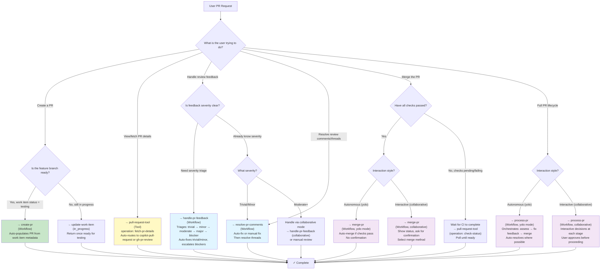

## Overview

This document provides a canonical decision tree for selecting the correct PR management skill based on user intent, current PR state, and workflow context. Use this to route user requests to the most appropriate skill.

## Quick Reference: Intent → Skill Mapping

| User Intent                   | State                                   | Recommended Skill                      | Context                                                                 |
| ----------------------------- | --------------------------------------- | -------------------------------------- | ----------------------------------------------------------------------- |
| **Create a PR**               | Feature branch ready, work item testing | `create-pr`                            | Workflow skill; auto-populates from work item metadata                  |
| **View PR status**            | PR exists                               | `pull-request-tool` (fetch-pr-details) | Tool skill; use copilot-pull-request or gh-pr-review backend            |
| **Address review feedback**   | PR has unresolved comments              | `handle-pr-feedback`                   | Workflow skill; severity-based triage + auto-fix minor issues           |
| **Resolve specific comments** | PR has review threads                   | `resolve-pr-comments`                  | Workflow skill; systematic comment-by-comment resolution                |
| **Merge the PR**              | PR ready to merge                       | `merge-pr`                             | Workflow skill; verification + safe merge                               |
| **Process PR end-to-end**     | PR needs full lifecycle processing      | `process-pr`                           | Workflow skill; orchestrates all stages (assess → review → fix → merge) |

## Decision Tree Flowchart



---

## Detailed Decision Logic

### 1. Create a PR

**User Intent**: "Create PR for this feature"

**Decision Questions**:

- Is feature branch created? → Yes → Continue
- Is work item status `testing`? → Yes → Continue
- Does PR already exist? → No → Continue

**Skill Selection**: `create-pr`

**What It Does**:

- Reads work item frontmatter (title, description, related commits)
- Generates PR title: `#<id>: <title>`
- Populates PR body with work item content + linked issues + test results
- Creates PR on GitHub
- Links PR number back to work item

**Example**:

```bash
# User says:
@agent create PR for work item 60

# Skill workflow:
1. Read backlog/060_filter_adapter.md
2. Generate title: "60: Implement FilterAdapter"
3. Generate description from work item content
4. Create PR on GitHub
5. Update work item: pr_number: 42
```

---

### 2. View PR Details

**User Intent**: "What's the status of PR #42?"

**Decision Questions**:

- Is PR number specified? → Yes → Continue
- Repository context clear? → Yes → Continue

**Skill Selection**: `pull-request-tool` with `operation: fetch-pr-details`

**What It Does**:

- Detects available backend (copilot-pull-request vs gh-pr-review)
- Fetches PR metadata: title, state, author, mergeable status, branch info
- Fetches CI/status checks: pass/fail status, required checks, pending checks
- Fetches review status: approval count, required approvals, blocking reviews
- Returns structured data suitable for agent/user consumption

**Example**:

```bash
# User says:
@agent what's the status of PR #42?

# Skill execution:
pull-request-tool:
  operation: fetch-pr-details
  pr-number: 42
  repository: owner/repo

# Outputs:
{
  "number": 42,
  "title": "60: Implement FilterAdapter",
  "state": "open",
  "mergeable": true,
  "statusCheckRollup": [
    { "name": "CI", "state": "PASS" },
    { "name": "Linter", "state": "PASS" },
    { "name": "Coverage", "state": "FAIL" }
  ],
  "reviewDecision": "APPROVED",
  "approvals": 2,
  "requiredApprovals": 1
}
```

---

### 3. Handle PR Feedback

**User Intent**: "Address the review feedback on PR #42"

**When to Use**: PR has review comments, need to triage scope/severity

**Decision Questions**:

- Does PR have unresolved comments? → Yes → Continue
- Should severity be auto-detected? → Yes (use this skill)

**Skill Selection**: `handle-pr-feedback`

**What It Does**:

1. **Triage comments by severity**:
   - **Trivial**: Typo, formatting → Auto-fix
   - **Minor**: Docstring, test comment → Auto-fix or quick reply
   - **Moderate**: Logic refinement, optimization → Flag for manual review
   - **Major**: Approach flaw, design issue → Escalate, potentially revert work item
   - **Blocker**: Architectural conflict, compliance → Escalate, revert to in_progress

2. **Auto-fix trivial/minor issues**:
   - Make inline code changes
   - Reply with explanation
   - Resolve threads

3. **Escalate major/blocking issues**:
   - Revert work item status to `in_progress`
   - Flag for developer review
   - Suggest scope changes if needed

**Example**:

```bash
# User says:
@agent handle feedback on PR #42

# Skill workflow:
1. Fetch unresolved comments
2. Categorize each:
   - Comment 1: "Add docstring" → Minor
   - Comment 2: "Use map instead of loop" → Moderate
   - Comment 3: "This violates RFC-007" → Blocker
3. Auto-fix minor issues
4. Reply to moderate: "This is an optimization, prioritizing correctness first"
5. Escalate blocker: Revert work item to in_progress, wait for developer
```

---

### 4. Resolve PR Comments

**User Intent**: "Address the review comments one by one"

**When to Use**: Know you need to address specific comment threads systematically

**Decision Questions**:

- Should comments be processed sequentially? → Default yes
- Are comments independent, can be parallel? → Yes if specified
- Should threads auto-resolve after addressing? → Default yes

**Skill Selection**: `resolve-pr-comments`

**What It Does**:

1. **Fetch all review threads** (filter: unresolved by default)
2. **Process each thread** (sequential or parallel):
   - Read the comment and context
   - Determine if code change needed or just reply
   - Execute action (code change + commit, reply, resolve thread)
3. **Push changes** if any code was modified
4. **Auto-resolve threads** after addressing

**Difference from handle-pr-feedback**:

- `resolve-pr-comments`: Assumes you're ready to address; focuses on systematic execution
- `handle-pr-feedback`: Triages severity first; may auto-fix trivial or escalate blockers

**Example**:

```bash
# User says:
@agent resolve review comments on PR #42

# Skill workflow:
1. List unresolved threads (e.g., 3 threads)
2. For each thread:
   a. Read comment: "Add docstring for filterValues method"
   b. Action: Code change needed
   c. Add docstring to code
   d. Commit: "docs: add docstring for filterValues"
   e. Reply: "Added docstring per review"
   f. Resolve thread
3. Push changes
4. Trigger CI re-run
```

---

### 5. Merge PR

**User Intent**: "Merge PR #42"

**When to Use**: PR is ready (checks pass, approvals received, no blockers)

**Decision Questions**:

- Are all required checks passing? → Yes → Continue
- Are required approvals met? → Yes → Continue
- Are there unresolved threads? → No (or policy allows) → Continue
- Interaction style? → yolo (autonomous) or collaborative (ask confirmation)

**Skill Selection**: `merge-pr` (with yolo or collaborative mode)

**What It Does**:

1. **Pre-merge verification** (sequential checks):
   - Fetch PR details
   - Verify mergeable status
   - Check approval count
   - Verify status checks
   - List unresolved threads

2. **Merge decision**:
   - YOLO: Auto-merge if all checks pass
   - Collaborative: Show summary, ask for confirmation + merge method selection

3. **Execute merge**:
   - Perform merge with specified method (squash/rebase/merge)
   - Delete branch if requested
   - Verify completion

**Example**:

```bash
# User says (yolo mode):
@agent merge PR #42

# Skill execution:
1. Verify: checks ✓, approvals ✓, mergeable ✓
2. Auto-merge with method "squash" (default)
3. Delete branch: true
4. Report: "PR #42 merged ✓"

# --OR-- User says (collaborative mode):
@agent merge PR #42 with confirmation

# Skill execution:
1. Show PR status summary
2. Ask: "Ready to merge using: [squash/rebase/merge]?"
3. User selects: squash
4. Execute merge
5. Report: "PR #42 merged ✓"
```

---

### 6. Process PR (End-to-End)

**User Intent**: "Process PR #42 from review to merge"

**When to Use**: Full PR lifecycle, starting from current state through merge

**Decision Questions**:

- Is PR in review/feedback phase? → Yes
- Should all stages be automated? → Interaction mode determines (yolo vs collaborative)

**Skill Selection**: `process-pr` (with interaction mode)

**What It Does**:

1. **Stage 1 - Initial Assessment** (parallel):
   - Fetch PR details
   - Check review status
   - Verify CI checks

2. **Stage 2 - Local Verification** (sequential, optional):
   - Checkout PR branch
   - Run tests
   - Verify build

3. **Stage 3 - Address Feedback** (sequential, if comments exist):
   - Invoke `resolve-pr-comments`
   - Address each comment
   - Push changes
   - Wait for CI

4. **Stage 4 - Final Verification** (parallel):
   - Confirm approvals
   - Confirm checks
   - Confirm mergeable

5. **Stage 5 - Merge** (sequential):
   - Invoke `merge-pr`
   - Execute safe merge
   - Delete branch

**Example**:

```bash
# User says (yolo mode):
@agent process PR #42

# Skill execution (autonomous, no prompts):
Stage 1: Assess PR status → Ready
Stage 2: Run tests → All pass
Stage 3: Address comments → 3 threads resolved
Stage 4: Final checks → All pass
Stage 5: Merge → Success
Report: "PR #42 processed and merged ✓"

# --OR-- User says (collaborative mode):
@agent process PR #42 interactively

# Skill execution (interactive, with decisions):
Stage 1: Assess → "PR ready for processing"
Stage 2: "Run local tests? [y/n]" → User: y
Stage 3: "Address 3 review comments? [y/n]" → User: y
         "Merge method? [squash/rebase/merge]" → User: squash
Stage 4: Verify → All ready
Stage 5: "Proceed with merge? [y/n]" → User: y
Report: "PR #42 processed and merged ✓"
```

---

## Skill Composition Map

```asciiflow
interaction-modes aspect (yolo | collaborative)
                          ↓
    ┌───────────────────────────────────────┐
    │                                       │
    ▼                                       ▼
  YOLO Mode                          Collaborative Mode
  (Autonomous)                        (Interactive)
    │                                       │
    ├─ Auto-decide                         ├─ Show options
    ├─ No prompts                          ├─ Get user input
    ├─ Report final result                 ├─ Confirm before action
    │                                       │
    └─────────────────────────────────────┘
                    │
            Tool-layer skills
                    │
        ┌───────────┴───────────┬──────────────┐
        ▼                       ▼              ▼
   pull-request-tool     (other tools)   (execution tools)
        │
        ├─ copilot-pull-request (API backend)
        │   └─ github-pull-request_* tools
        │
        └─ gh-pr-review (CLI backend)
            └─ GitHub CLI commands

    Workflow-layer skills (compose tools + aspects)
        │
        ├─ create-pr
        ├─ handle-pr-feedback
        ├─ resolve-pr-comments
        ├─ merge-pr
        └─ process-pr
```

---

## Common Workflows

### Workflow A: Create PR, Wait for Feedback

```markdown
1. Feature branch ready
2. @agent create PR for work item 60
   → create-pr executes
   → PR #42 created
3. Wait for reviews...
4. Reviews arrive
```

### Workflow B: Address Feedback, Merge

```markdown
1. PR #42 has review comments
2. @agent handle feedback on PR #42
   → handle-pr-feedback triages
   → Auto-fixes trivial issues
   → Escalates major issues if any
3. Reviews approved
4. @agent merge PR #42
   → merge-pr verifies
   → Merges to main
```

### Workflow C: Single-Command End-to-End

```markdown
1. PR #42 ready for final processing
2. @agent process PR #42 end-to-end
   → process-pr orchestrates full lifecycle
   → Addresses feedback
   → Merges when ready
```

---

## Interaction Modes

### YOLO Mode (Autonomous)

- **No user prompts**: Skill makes decisions using heuristics
- **Fast**: Single invocation, minimal interaction
- **Suitable for**: CI/CD pipelines, repetitive processes, high-trust environments
- **Risk**: May make wrong decision without user oversight

**Example**:

```bash
@agent merge PR #42
# Automatically merges if all checks pass; fails if any blocker
# No confirmation prompt
```

### Collaborative Mode (Interactive)

- **User prompts at decision points**: Show options, get confirmation
- **Slower**: Multiple interactions required
- **Suitable for**: High-stakes decisions, learning workflows, audit requirements
- **Benefit**: User retains control; audit trail of decisions

**Example**:

```bash
@agent merge PR #42 with confirmation
# Shows PR status
# Asks: "Ready to merge? [squash/rebase/merge]?"
# Waits for user response before merging
```

---

## Backend Selection (Automatic)

Users should not need to select backend. `pull-request-tool` automatically:

1. **Detects environment**:
   - Is Copilot API available? → Use `copilot-pull-request`
   - Else is GitHub CLI (`gh`) available? → Use `gh-pr-review`
   - Else → Error: No backend available

2. **Routes to appropriate backend**:
   - `copilot-pull-request`: API-based, agent-native, most reliable
   - `gh-pr-review`: CLI-based, requires `gh` + optional extension

3. **Normalizes output**:
   - Both backends return data in same format (per `PR_MANAGEMENT_INTERFACE.md`)
   - Agent/user sees consistent output regardless of backend

---

## Troubleshooting Decision Making

### **"Should I use merge-pr or process-pr?"**

- Already reviewed, checks pass, just need merge → `merge-pr`
- Need full lifecycle (review → fix → merge) → `process-pr`

### **"Should I use handle-pr-feedback or resolve-pr-comments?"**

- Need severity triage, may auto-fix trivial issues → `handle-pr-feedback`
- Ready to address each comment systematically → `resolve-pr-comments`

### **"Should I use yolo or collaborative mode?"**

- High-trust, CI/CD, repetitive → `yolo`
- High-stakes, learning, audit → `collaborative`

### **"Why does my skill not work?"**

- Check PR state: Is PR open? Mergeable? Status checks passing?
- Check permissions: Does agent have repo access? Write permissions?
- Check backend: Is Copilot API available or GitHub CLI installed?

---

## Version History

**v1.0** (2026-02-25):

- Initial canonical decision tree
- Covers create, fetch, feedback, resolve comments, merge, process-pr
- Documents interaction modes (yolo/collaborative)
- Backend selection automated
